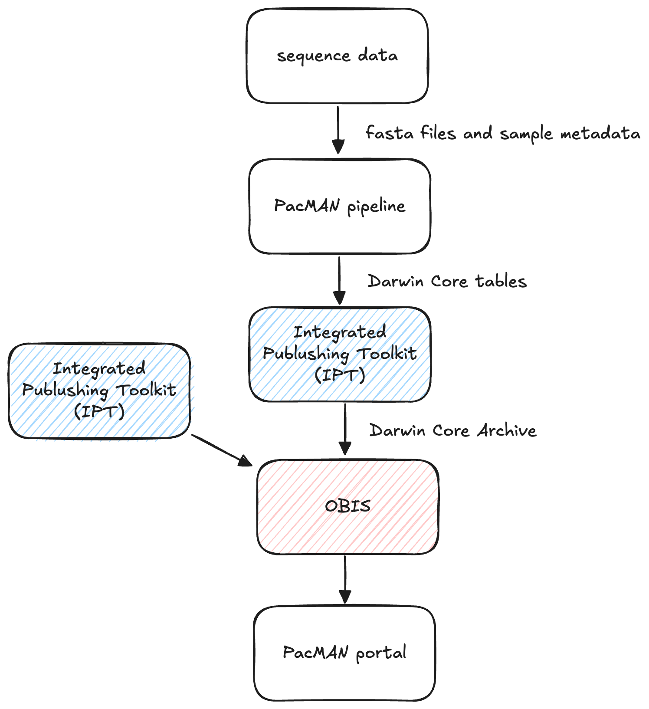

# PacMAN final meeting training

The goal of this training session is to go over the data submission process for the PacMAN decision support tool, and do a hands-on demonstration of every step in the process.

## PacMAN data flow

The PacMAN decision support system integrates detections from various sources by connecting to the OBIS database. Data publishing to OBIS typically happens through an **Integrated Publishing Toolkit (IPT)** instance. This is also the case for the PacMAN monitoring campaigns. Before sequence data from eDNA sampling can be published to OBIS, it needs to be **processed and formatted in the Darwin Core format**. Processing involves quality controlling and trimming of sequences, ASV inference, and taxonomic annotation. These steps are taken care of by the [PacMAN bioinformatics pipeline](https://github.com/iobis/PacMAN-pipeline).



## The PacMAN bioinformatics pipeline

### Taxonomic annotation

The PacMAN pipeline uses a number of taxonomic annotation algorithms. The main taxonomic assignment, which is used to populate the `scientificName` field in Darwin Core, is the naïve Bayesian classifier RDP Classifier. RDP Classifier calculates a probability for every possible taxonomic annotation using k-mer frequences, and then applies a bootstrapping procedure to obtain a confidence score for each taxonomic level.

The pipeline also includes a VSEARCH step which uses k-mer based search to find the closest matches in a reference database. VSEARCH also provides a similarity score for each matching sequence. The results from this alternative algorithm are included in the `identificationRemarks` Darwin Core field.


| Algorithm | Results | Darwin Core field |
| --- | --- | --- |
| RDP Classifier | family X (confidence 1), genus Y (confidence 0.9), species B (confidence 0.3) | scientificName |
| VSEARCH |  family X, genus Y, species A (identity 0.997) <br/> family X, genus Y, species B (identity 0.995) <br/> family X, genus Y, species B (identity 0.995) <br/> family X, genus Y, species A (identity 0.992) <br/> family X, genus Z, species C (identity 0.983) <br/> family X, genus Z, species C (identity 0.975) | identificationRemarks |

### Running the PacMAN pipeline

The PacMAN bioinformatics pipeline is workflow based on commonly used bioinformatics tools and custom scripts. The pipeline is orchestrated using the Snakemake workflow management system. Snakemake takes care of installing the necessary dependencies in Conda environments, and running the different steps of the pipeline in the correct order.

In addition to installing Conda and Snakemake locally, it's also possible to run the pipeline using Docker. In this case, the pipeline is encapsulated in a Docker container, and the data and results folders are mounted as "volumes" so they can be shared between the Docker container and the host machine.


The following files are required to run the pipeline:

- Configuration file
- Manifest
- Sample metadata
- Raw sequences
- RDP reference database
- VSEARCH reference database

See the [data preparation section](https://github.com/iobis/PacMAN-pipeline/blob/master/README.md#data-preparation) in the pipeline README for example files and reference database downloads. Structure the files like this:

```
└── data
    ├── config_files
    │   ├── config.yaml
    │   ├── manifest.csv
    │   └── sample_data.csv
    ├── raw_sequences
    │   ├── USP-24-01-172_S172_L001_R1_001.fastq.gz
    │   └── USP-24-01-172_S172_L001_R2_001.fastq.gz
    └── reference_databases
        ├── COI_ncbi_1_50000_pcr_pga_taxon_derep_clean_sintax.fasta
        └── COI_terrimporter
            ├── bergeyTrainingTree.xml
            ├── genus_wordConditionalProbList.txt
            ├── logWordPrior.txt
            ├── rRNAClassifier.properties
            └── wordConditionalProbIndexArr.txt
```

Run the pipeline with Snakemake or Docker using either of the following commands:

```bash
snakemake --use-conda --configfile data/config_files/config.yaml --rerun-incomplete --printshellcmds

docker run --platform linux/amd64 \
    -v $(pwd)/data:/pipeline/data \
    -v $(pwd)/results:/pipeline/results \
    -v $(pwd)/.snakemake:/pipeline/.snakemake \
    pieterprovoost/pacman-pipeline
```


### PacMAN pipeline results

:warning: To do: add screenshots.

#### Pipeline report

Sign into the [OBIS JupyterHub](https://jupyter.obis.org/) to explore an example pipeline result dataset. JupyterHub is an online coomputing environment that allows us to explore data data without the need to download any files or install any software locally.

Navigte to the example dataset in `shared/example_results` and check the following files:

- The pipeline report in `results/PacMAN/runs/COI/06-report`
- The Darwin Core tables in `results/PacMAN/runs/COI/05-dwca`
  - `Occurrence_table.tsv`
  - `DNA_extension_table.tsv`

#### Exploring taxonomic composition in R

The pipeline results are also available as a `phyloseq` object, which makes it very convenient to analyse the dataset in R. To read more about this data format, continue to the [phyloseq website](https://joey711.github.io/phyloseq/import-data.html#phyloseq-ize_data_already_in_r).

For example, to visualize the taxonomic composition of the dataset as a Krona plot, run the following code in an R notebook:

```R
library(dplyr)
library(psadd)
library(phyloseq)

ps <- readRDS("shared/example_results/05-dwca/phyloseq_object.rds")

tax_table(ps) <- tax_table(ps) %>%
    as.data.frame() %>%
    select(phylum, class, order, family, genus, species) %>%
    as.matrix(rownames.force = T)

plot_krona(ps, output = "krona_plot", variable = "eventID")
```

Then open the resulting `krona_plot.html` file.


## Biodiversity data publishing

After conversion to Darwin Core tables, our dataset can be published to OBIS trough a Integrated Publishing Toolkit (IPT) instance. IPT allows us to enter metadata through a form, and map the columns in our tables to Darwin Core fields. The result will be a Darwin Core Archive file which can be ingested by platforms such as OBIS and GBIF. This archive contains our data tables, a metadata document, and a document describing the structure of our dataset (tables and fields).


For this training we will work on the OBIS training IPT. Go to <https://ipt.iobis.org/training> and sign in with the provided credentials.

Before proceeding, download the occurrence and DNA tables from the example dataset in JupyterHub (find both files in `results/PacMAN/runs/COI/05-dwca`).

To create a new dataset in IPT, navigate to the `Manage Resources` tab and click `Create new`.

### IPT metadata form

Scroll to the `Metadata` section and click `Edit`. Minimal metadata needs to be completed to be able to publish the dataset, such as a title, license, description, and contacts. After completing the form, click `Save` at the top.

### IPT data upload

Go back to the dataset overview and scroll to the `Source Data` section. Click `Add` on the right. Upload the Ocurrence and DNADerivedData files, but make sure to check if the number of columns detected is correct. If not, adjust the field delimiter (should be `\t`), and click `Options > Analyze` at the top to update the number of columns.

### IPT terms mapping

Now go to `Darwin Core Mappings` and click `Add`. First select `Darwin Core Occurrence` and pick the appropriate source file. Click `Save` to continue.

As the files are using Darwin Core terms, the mapping is done automatically and we can confirm with `Save`.

### IPT publishing

We are now ready to publish. First set visibility to public the `Visibility` section, then go to the `Publishing` section, and click `Publish` on the right. If we were working on a production IPT instance, the dataset would now be ingested by OBIS and be available for the decision support system.

To see how records are made available by the OBIS system, run [this API call](https://api.obis.org/occurrence?geometry=POLYGON%20((178.342438%20-18.216307,%20178.342438%20-18.071451,%20178.534698%20-18.071451,%20178.534698%20-18.216307,%20178.342438%20-18.216307))) which fetches occurrence data from the Suva area.

## Decision support
## Other resources

- [OBIS SG 12 training](https://github.com/iobis/sg-12-training): training materials on R, JupyterHub, git, and DNADerivedData.
- [First PacMAN training](https://github.com/iobis/pacman-pipeline-training): training materials on data management, R, the PacMAN bioinformatics pipeline.
- [PacMAN pipeline](https://github.com/iobis/PacMAN-pipeline): the PacMAN bioinformatics pipeline.