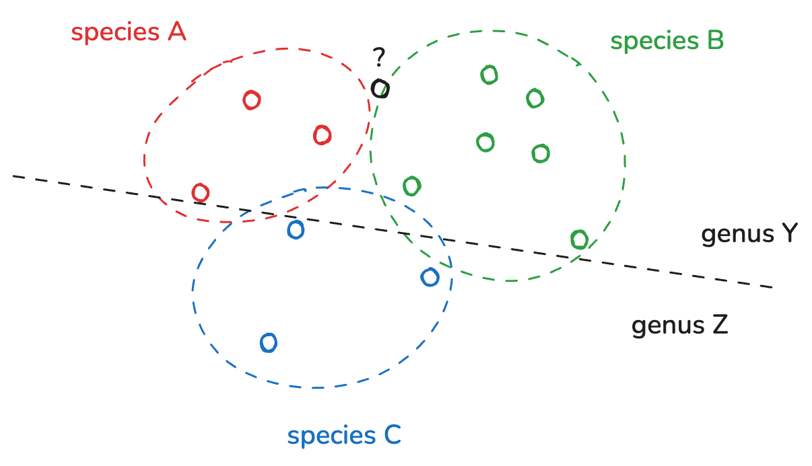

# PacMAN final meeting training
## PacMAN data flow

The PacMAN decision support system integrates detections from various sources by connecting to the OBIS database. Data publishing to OBIS typically happens through an Integrated Publishing Toolkit (IPT) instance. This is also the case for the PacMAN monitoring campaigns. Before sequence data from eDNA sampling can be published to OBIS, it needs to be processed and formatted in the Darwin Core Archive format. Processing involves quality controlling and trimming of sequences, ASV inference, and taxonomic annotation. These steps are taken care of by the [PacMAN bioinformatics pipeline](https://github.com/iobis/PacMAN-pipeline).


## The PacMAN bioinformatics pipeline

### Taxonomic annotation

The PacMAN pipeline uses a number of taxonomic annotation algorithms. The main taxonomic assignment, which is used to populate the `scientificName` field in Darwin Core, is the naïve Bayesian classifier RDP Classifier. RDP Classifier calculates a probability for every possible taxonomic annotation using kmer frequences, and then applies a bootstrapping procedure to obtain a confidence score for each taxonomic level.

The pipeline also includes a VSEARCH step which uses kmer search to find the closest matches in a reference database. VSEARCH also provides a similarity score for each match. 



| Algorithm | Results |
| --- | --- |
| RDP Classifier | family X (confidence 1), genus Y (confidence 0.9), species B (confidence 0.3) |
| VSEARCH |  family X, genus Y, species A (identity 0.997) <br/> family X, genus Y, species B (identity 0.995) <br/> family X, genus Y, species B (identity 0.995) <br/> family X, genus Y, species A (identity 0.992) <br/> family X, genus Z, species C (identity 0.983) <br/> family X, genus Z, species C (identity 0.975) <br/>|


### Running the PacMAN pipeline

The PacMAN bioinformatics pipeline is workflow based on commonly used bioinformatics tools and custom scripts. The pipeline can be run using the Snakemake workflow management system. Snakemake takes care of installing the necessary dependencies in Conda environments, and running the different steps of the pipeline in the correct order.

In addition to installing Conda and Snakemake locally, it's also possible to run the pipeline using Docker. In this case, the pipeline is encapsulated in a Docker container, and the data folders are mounted as volumes.


The following files are required to run the pipeline:

- Configuration file
- Manifest
- Sample metadata
- Raw sequences
- RDP reference database
- VSEARCH reference database

See the [data preparation section](https://github.com/iobis/PacMAN-pipeline/blob/master/README.md#data-preparation) in the pipeline README for example files and reference database downloads. Structure the files like this:

```
└── data
    ├── config_files
    │   ├── config.yaml
    │   ├── manifest.csv
    │   └── sample_data.csv
    ├── raw_sequences
    │   ├── USP-24-01-172_S172_L001_R1_001.fastq.gz
    │   └── USP-24-01-172_S172_L001_R2_001.fastq.gz
    └── reference_databases
        ├── COI_ncbi_1_50000_pcr_pga_taxon_derep_clean_sintax.fasta
        └── COI_terrimporter
            ├── bergeyTrainingTree.xml
            ├── genus_wordConditionalProbList.txt
            ├── logWordPrior.txt
            ├── rRNAClassifier.properties
            └── wordConditionalProbIndexArr.txt
```

Run the pipeline with Snakemake or Docker using the following commands:

```bash
snakemake --use-conda --configfile data/config_files/config.yaml --rerun-incomplete --printshellcmds

docker run --platform linux/amd64 \
    -v $(pwd)/data:/pipeline/data \
    -v $(pwd)/results:/pipeline/results \
    -v $(pwd)/.snakemake:/pipeline/.snakemake \
    pieterprovoost/pacman-pipeline
```


## Biodiversity data publishing
## Decision support
## Other resources

- [OBIS SG 12 training](https://github.com/iobis/sg-12-training): training materials on R, JupyterHub, git, and DNADerivedData.
- [First PacMAN training](https://github.com/iobis/pacman-pipeline-training): training materials on data management, R, the PacMAN bioinformatics pipeline.
- [PacMAN pipeline](https://github.com/iobis/PacMAN-pipeline): the PacMAN bioinformatics pipeline.